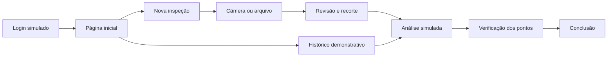
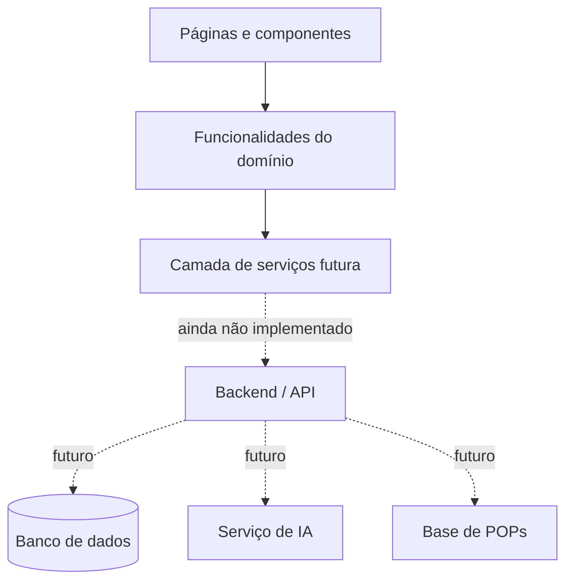

<div align="center">
  

  <p><strong>Inspeções mais claras, decisões mais seguras.</strong></p>

  <p>
    
    
    
    
    
    
    
  </p>
</div>

---

## Estado do projeto

> [!WARNING]
> **O backend do QualiScan AI ainda não foi desenvolvido.** Não existem API, banco de dados, autenticação real, reconhecimento de materiais, leitura de POPs ou processamento por inteligência artificial nesta versão. As análises, peças, procedimentos e históricos exibidos pelo frontend são demonstrativos e locais.

O repositório contém um protótipo avançado do frontend, preparado para validar a experiência de uso antes da integração com serviços reais.

| Camada | Estado | Observação |
| --- | --- | --- |
| Frontend web | Implementado | Interface responsiva e fluxo demonstrativo completo. |
| Captura por câmera | Implementado no navegador | Utiliza a API de mídia do dispositivo e requer permissão do usuário. |
| Recorte da imagem | Implementado localmente | A seleção é processada no próprio navegador. |
| Análise visual | Simulada | Marcações e recomendações usam dados fixos do protótipo. |
| Histórico | Simulado | Busca funcional sobre registros locais demonstrativos. |
| Autenticação | Simulada | Não existe sessão, usuário ou validação em servidor. |
| Backend/API | **Não implementado** | Diretório reservado em `src/backend`. |
| Inteligência artificial | **Não implementada** | Nenhum modelo é executado ou consultado. |
| Banco de dados | **Não implementado** | Nenhuma informação é persistida. |

## Sobre o QualiScan AI

O QualiScan AI é uma proposta de software para apoiar inspeções de qualidade em ambientes industriais. O produto deverá permitir que o inspetor fotografe um material ou componente e receba orientações visuais sobre regiões que exigem atenção, utilizando como referência:

- procedimentos operacionais padrão (POPs);
- critérios internos de qualidade;
- histórico de ocorrências do material;
- reconhecimento visual assistido por inteligência artificial;
- confirmação técnica realizada pelo próprio inspetor.

O sistema é pensado como ferramenta de apoio. A decisão final continua pertencendo ao profissional responsável e aos procedimentos oficiais da empresa.

## Funcionalidades disponíveis no frontend

- Login demonstrativo com validação local de formulário.
- Página inicial responsiva com apresentação do produto.
- Guia detalhado de utilização do QualiScan.
- Captura real de foto pela câmera do dispositivo.
- Envio de arquivos JPG, PNG e WebP com limite de 10 MB.
- Seleção e recorte de uma região da imagem com mouse ou toque.
- Pré-visualização e substituição da foto antes da análise.
- Resultado simulado com pontos interativos sobre a imagem.
- Checklist de regiões verificadas pelo inspetor.
- Referências demonstrativas a POPs.
- Histórico local de peças analisadas com busca por nome ou código.
- Navegação responsiva e cabeçalho fixo.
- Animações de entrada durante a rolagem e ambientação 3D decorativa.
- Suporte à preferência `prefers-reduced-motion` do sistema operacional.
- Imagem Docker de produção servida por Nginx.

## Fluxo demonstrativo



1. Acesse a aplicação pela tela de login.
2. Informe um e-mail válido e uma senha com pelo menos seis caracteres.
3. Inicie uma inspeção pela página principal.
4. Abra a câmera ou selecione uma imagem existente.
5. Arraste sobre a foto para selecionar uma área, se necessário, e aplique o recorte.
6. Confirme a imagem e abra o resultado demonstrativo.
7. Selecione as marcações, consulte os critérios e confirme cada ponto.
8. Consulte inspeções anteriores na área **Análises**.

## Arquitetura

O repositório separa explicitamente frontend e backend para permitir que as duas camadas evoluam sem acoplamento direto.

```text
qualiscan/
├── Dockerfile                    # build de produção do frontend
├── docker/
│   └── nginx.conf                # Nginx e fallback das rotas da SPA
├── src/
│   ├── backend/
│   │   └── README.md             # espaço reservado; backend não implementado
│   └── frontend/
│       ├── public/
│       │   └── assets/
│       │       ├── brand/        # logos e símbolo do QualiScan
│       │       └── images/       # imagens públicas do protótipo
│       ├── src/
│       │   ├── app/
│       │   │   ├── providers/    # composição de recursos globais
│       │   │   └── router/       # rotas e carregamento sob demanda
│       │   ├── components/
│       │   │   ├── feedback/     # carregamento e estados de rota
│       │   │   ├── motion/       # animações e ambientação visual
│       │   │   └── ui/           # componentes reutilizáveis
│       │   ├── features/
│       │   │   ├── authentication/
│       │   │   ├── inspection-results/
│       │   │   └── material-capture/
│       │   ├── layouts/          # cabeçalho e estruturas compartilhadas
│       │   ├── pages/            # login, home, captura, análise e histórico
│       │   ├── services/         # fronteira reservada para a futura API
│       │   ├── styles/           # tema e estilos globais
│       │   ├── types/            # tipos compartilhados futuros
│       │   └── main.tsx          # entrada da aplicação
│       ├── ARCHITECTURE.md
│       ├── package.json
│       └── vite.config.ts
├── .dockerignore
└── .gitignore
```

### Responsabilidades por camada



O frontend segue estas regras:

- `pages` compõem telas e rotas;
- `features` concentram comportamentos específicos do produto;
- `components/ui` reúne elementos visuais reutilizáveis;
- `components/motion` concentra animações reutilizáveis;
- `layouts` define estruturas compartilhadas entre telas;
- `services` será a única fronteira de comunicação com a futura API;
- dados demonstrativos permanecem locais enquanto o backend não existir.

## Rotas

| Rota | Descrição |
| --- | --- |
| `/` | Entrada inicial pela tela de login. |
| `/login` | Acesso demonstrativo ao produto. |
| `/home` | Página principal e apresentação do fluxo. |
| `/scan` | Câmera, upload, revisão e recorte da imagem. |
| `/analysis` | Resultado simulado e pontos de atenção. |
| `/history` | Histórico demonstrativo de peças analisadas. |

O roteamento utiliza fallback de SPA. Ao executar com Nginx, rotas acessadas diretamente retornam corretamente ao `index.html`.

## Tecnologias

| Tecnologia | Uso |
| --- | --- |
| React 19 | Interface baseada em componentes. |
| TypeScript 6 | Tipagem estática e contratos internos. |
| Vite 8 | Desenvolvimento e build de produção. |
| React Router 7 | Navegação e divisão das páginas. |
| Tailwind CSS 4 | Sistema visual e responsividade. |
| Lucide React | Ícones da interface. |
| Radix Slot | Composição acessível dos botões e links. |
| Nginx | Entrega dos arquivos estáticos em produção. |
| Docker | Empacotamento do frontend. |

## Execução local

### Pré-requisitos

- Node.js 22 ou superior;
- npm;
- navegador moderno com suporte a `getUserMedia` para captura pela câmera.

### Instalação

```bash
cd src/frontend
npm ci
npm run dev
```

A aplicação ficará disponível, por padrão, em `http://localhost:5173`.

> [!NOTE]
> O acesso à câmera funciona em contexto seguro. Durante o desenvolvimento, `localhost` é aceito pelos navegadores. Em uma implantação remota, configure HTTPS.

### Credenciais do protótipo

Não existe usuário cadastrado. Para entrar, utilize:

- qualquer endereço de e-mail com formato válido;
- qualquer senha com seis ou mais caracteres.

Essas informações não são enviadas nem armazenadas.

## Scripts do frontend

Execute os comandos dentro de `src/frontend`.

| Comando | Finalidade |
| --- | --- |
| `npm run dev` | Inicia o servidor de desenvolvimento. |
| `npm run typecheck` | Valida os tipos TypeScript. |
| `npm run lint` | Executa as regras de qualidade do código. |
| `npm run build` | Gera o bundle de produção em `dist`. |
| `npm run preview` | Visualiza localmente o bundle produzido. |

## Docker

O `Dockerfile` localizado na raiz utiliza duas etapas:

1. instalação e build do frontend com Node.js;
2. entrega dos arquivos estáticos por Nginx.

```bash
docker build -t qualiscan-frontend .
docker run --rm -p 8080:80 qualiscan-frontend
```

Depois, acesse `http://localhost:8080`.

O contêiner inclui `HEALTHCHECK`, compactação gzip, cache de arquivos estáticos, cabeçalhos básicos de segurança e fallback para as rotas da aplicação.

## Privacidade no protótipo

- Fotos selecionadas ou capturadas permanecem na memória do navegador.
- O recorte é realizado localmente com Canvas.
- Credenciais não são enviadas para servidores.
- Nenhum dado é persistido ao atualizar ou fechar a página.
- Não existe telemetria configurada nesta versão.

Essas condições mudarão quando o backend for implementado e deverão ser acompanhadas por autenticação, autorização, política de retenção, criptografia e controles de acesso adequados.

## Backend pendente

O diretório `src/backend` é apenas uma reserva arquitetural. A futura implementação deverá definir, no mínimo:

- API autenticada;
- cadastro de usuários e permissões;
- armazenamento seguro das imagens;
- cadastro e versionamento de materiais;
- ingestão, consulta e versionamento de POPs;
- execução ou integração com modelos de visão computacional;
- histórico persistente de inspeções;
- trilha de auditoria;
- observabilidade, métricas e tratamento de erros;
- contratos versionados para comunicação com o frontend.

Até que essa camada exista, o QualiScan AI deve ser tratado exclusivamente como **protótipo visual e funcional de frontend**, não como sistema de inspeção em produção.

## Roadmap sugerido

- [x] Fundação do frontend e identidade visual.
- [x] Login demonstrativo e navegação responsiva.
- [x] Captura por câmera, upload e recorte local.
- [x] Resultado e histórico demonstrativos.
- [x] Dockerfile de produção do frontend.
- [ ] Definição dos contratos da API.
- [ ] Implementação do backend e banco de dados.
- [ ] Autenticação e autorização reais.
- [ ] Gestão e versionamento de POPs.
- [ ] Pipeline de reconhecimento de materiais.
- [ ] Persistência e auditoria das inspeções.
- [ ] Testes automatizados de integração e ponta a ponta.
- [ ] Homologação técnica e de segurança.

## Qualidade

Antes de entregar alterações no frontend, execute:

```bash
cd src/frontend
npm run typecheck
npm run lint
npm run build
```

Essas verificações validam tipos, regras estáticas e geração do bundle. Elas não substituem testes automatizados, que ainda precisam ser adicionados ao projeto.
